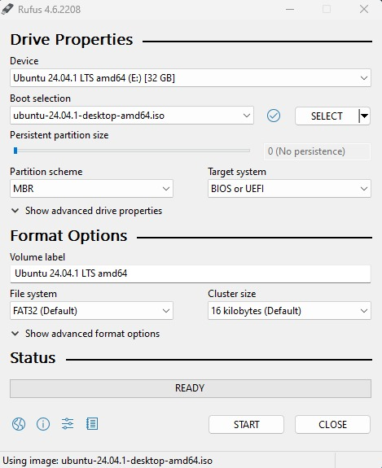
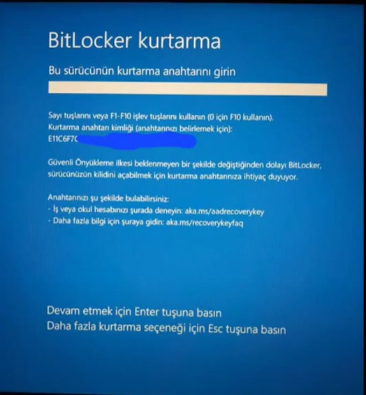
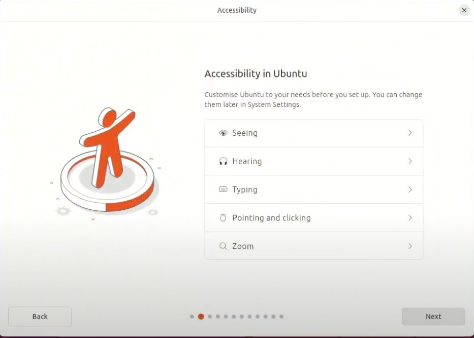
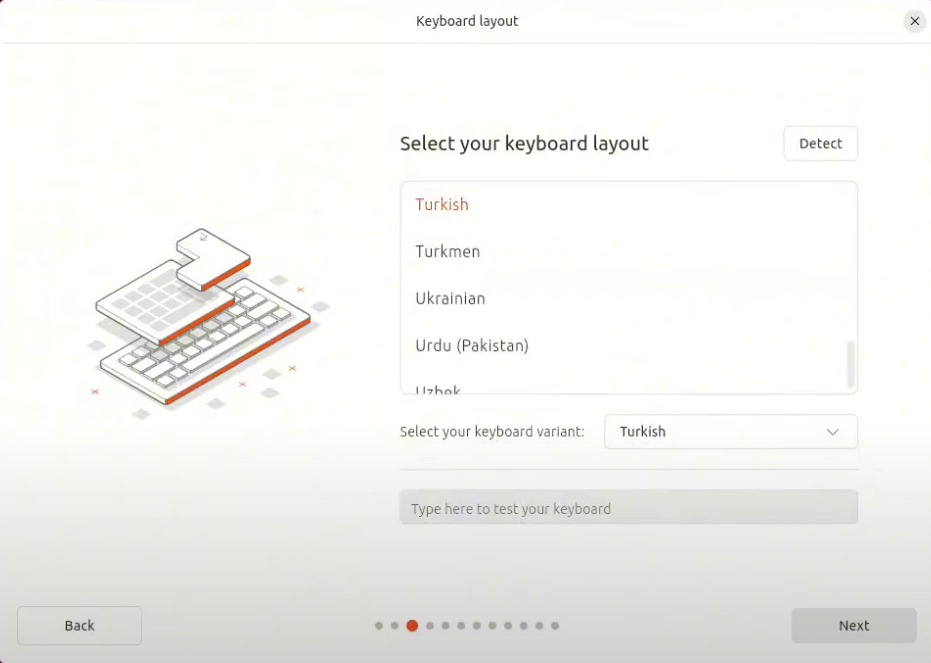
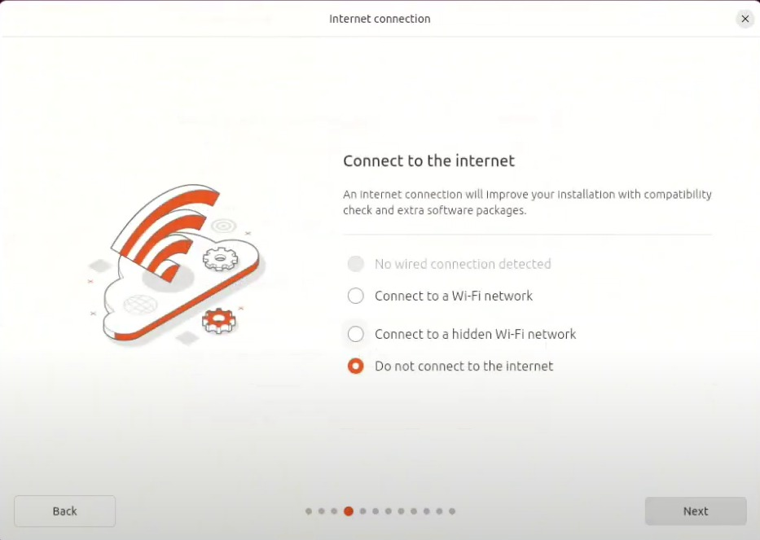
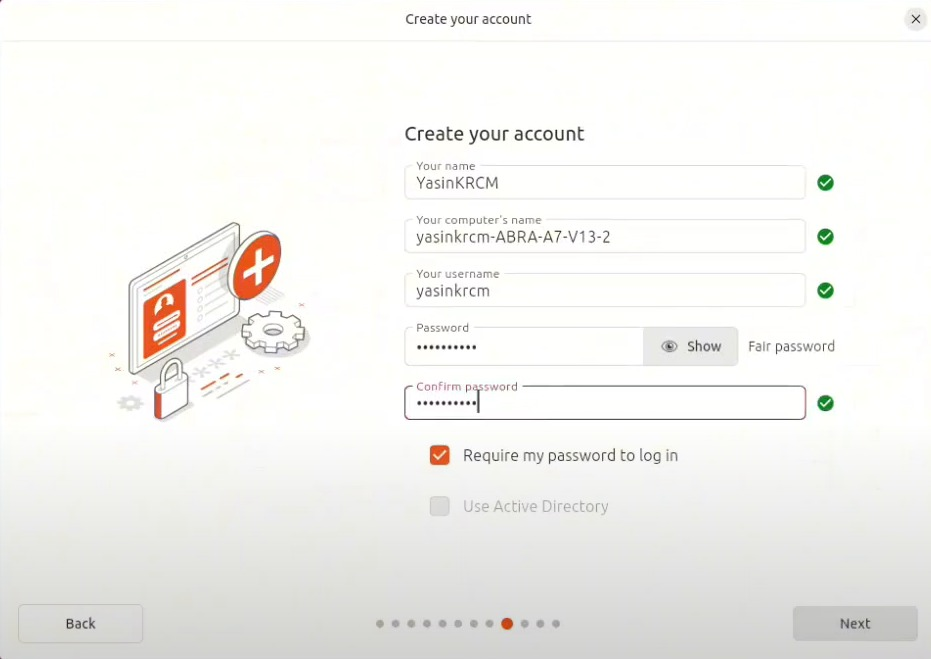
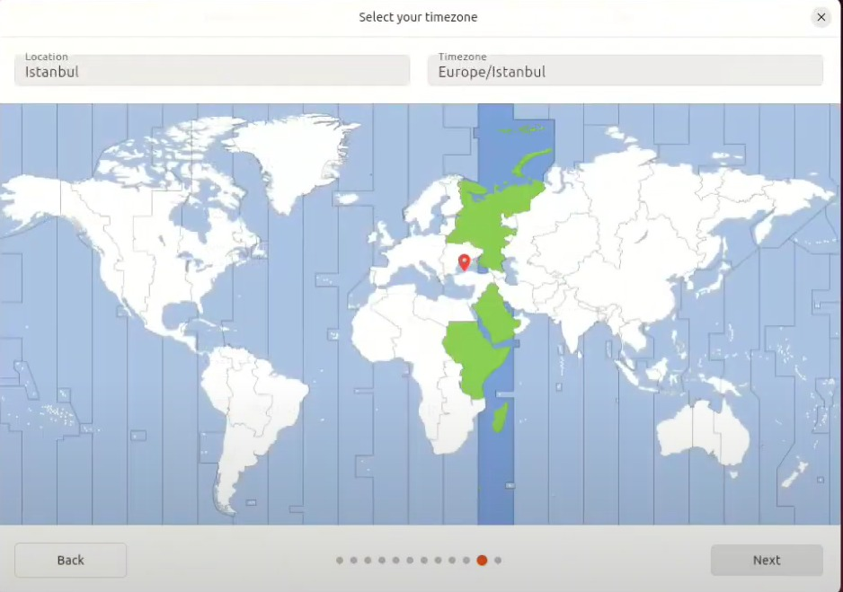

</ul><h1>Ubuntu 24.04 Kurulum Rehberi</h1>

Bu rehber, Ubuntu 24.04'ün nasıl kurulacağını adım adım açıklamaktadır. Her adımın ekran görüntüsünü eklemeyi unutmayın ve aşağıda belirtilen adımların sırasını takip edin.

<h2>Gereksinimler</h2>
<ul>
    <li>Boş bir USB sürücü (en az 4 GB)</li>
    <li>Ubuntu 24.04 ISO dosyası (Ubuntu'nun <a href="https://ubuntu.com/download">resmi web sitesinden</a> indirilebilir)</li>
    <li>Rufus (Rufus'un <a href="https://rufus.ie/tr/">resmi web sitesinden</a> indirilebilir)</li>
</ul>

<h2>Kurulum Aşamaları</h2>
    <h2>Ubuntu ISO Dosyasını İndirin</h2>
    <ul>
        <li>Ubuntu'nun <a href="https://ubuntu.com/download">resmi indirme sayfasına</a></li>
        
        <li>Bu sayfadan "Download Ubuntu Desktop" seçeneğine basıyoruz.</li>
        
        <li>Bu sayfadan yeşil ile belirtilen "Download 24.04 .1 LTS" tuşa basın sonrasında biraz bekleyince otomatik olarak indirme başlayacaktır.</li>
    </ul>
    <h2>USB Sürücüsüne Yazdırın</h2>
    <ul>
        <!-- <li>İndirdiğiniz ISO dosyasını bir USB yazma aracı ile USB sürücüsüne yazdırın</li> -->
        
        <li>Bu sayfadan Windows bit'imize ve donanımıza uygun olan sürümümüzü seçiyoruz. İndirme gerçekleşecek sonrasında .exe dosyasını açıyoruz. </li>
        
        <li>Ardından "Seç" Tuşuna basarak indirdiğimiz ISO dosyasını seçiyoruz. Ardından "BAŞLA" seçeneğine basıyoruz  <h3>DİKKAT!</h3> 
<b>USB Belleğinizdeki verileri yedeklemeyi unutmayınız!</b>
  </li>
    </ul>
    <h2>Bilgisayarınızı USB'den Başlatın</h2>
    <ul>
        <li>USB sürücüsünü bilgisayara takın ve bilgisayarınızı USB'den başlatmak için BIOS/UEFI ayarlarını yapılandırın</li>
        <!-- Screenshot 3: BIOS/UEFI ayarları -->
        <li>BIOS menüsü için bilgisayarınız açılırken F2 tuşuna basınız.</li>
        
        <li>BIOS menüsü açıldıktan sonra buradan "Administer Secure Boot" (bazı bilgisayarlarda "Secure Boot" olarak geçer Monster için bu şekilde) seçeneğine geliyoruz.</li>
        
        <li>Bu menüden Secure Boot Seçeneğini kapatıyoruz.Sonrasında Save Changes and Exit diyip çıkış yapınız.Eğer Windows'un yanına UBUNTU kurmak istiyorsanız  Windows'un gelmesini bekliyoruz</li>
    </ul>
    <h2>BITLOCKER HATASI(DUALBOOT)</h2>
    <ul>
        
        <li>Eğer bilgisayarınız  açılırken böyle bir hatayla karşılaşıyorsanız.BIOS menüsüne tekrar gelip Secure Boot'u açıp Windows'a geri dönmeniz gerekiyor Ardından Arama kısmına "Bitlocker'ı yönet" seçeneğine basıp Bitlocker'ı kapatmanız gerekiyor(Bende kapalı  olduğu  için Aç yazıyor)</li>
        
        <li>Bu işlemleri tamamladıysak tekrar BIOS menüden Secure Boot'u kapatıp devam edebiliriz.</li>
    </ul>
    <h2>BOOT SEÇİMİ</h2>
        <ul>
            <li>Tekrardan BIOS menüsüne geliyoruz sonrasında BOOT MANAGER'e tıklıyoruz</li>
            
            <li>Sonrasında USB belleğimizi seçiyoruz.</li>
        </ul>
    <h2>TRY OR INSTALL UBUNTU</h2>
        <ul>
            
            <li>Bir süre bekledikten sonra bu seçenekler karşımıza geldiğinde "Try or Install Ubuntu" seçeneğine tıklıyoruz.</li>
            
            <li>Ardından bu yükleme alanı karşımıza çıkıyor bekliyoruz.</li>
        </ul>        
    <h2>Genel Ayarlar.</h2>
        <ul>
            <li>Kurulum sırasında dil ve klavye düzenini seçin</li>
            <!-- Screenshot 5: Dil ve klavye ayarları -->
            
            
            <li>Bu menü Erişebilirlik menüsü ihtiyacınıza bağlı olanları seçebilirsiniz</li>
            
            <li>Buradan kullandığınız klavye dili ve tipini seçebilirsiniz.</li>
            
            <li>WIFI'mizi seçiyoruz.</li>
            
            <li>Bu Menüden Install Ubuntu seçeneğine tıklıyoruz.</li>
            
            <li>
            Etkileşimli kurulum ve Otomatik kurulum arasında seçim yapmanız istenecektir. 
            Etkileşimli seçenek standart yol olarak kabul edilir, ancak daha deneyimli kullanıcılar, 
            bir web sunucusundan bir yapılandırma dosyası ithal ederek birden fazla kurulumu standart 
            hale getirmek ve ek özelleştirmeler eklemek için otomatik kurulum seçeneğini kullanabilirler
            Otomatik kurulum için bir örnek eğitim  mevcuttur.
            <a href="https://blog.local-optimum.net/getting-started-with-autoinstall-on-ubuntu-desktop-24-04-lts-147a1defb2de"> burada</a> mevcuttur.</li>
            
            <li>
            Varsayılan seçim ve Genişletilmiş seçim seçenekleri arasında seçim yapmanız istenecektir. 
                Varsayılan kurulum, başlangıç için gereken temel unsurları içerir; bu unsurları kurulumdan
                sonra Uygulama Merkezi'ni kullanarak genişletebilirsiniz. Genişletilmiş seçim ise çevrimdışı 
                durumlar için faydalı olan ek ofis araçları ve yardımcı programlar içerir.</li>
        </ul>
    <h2>Disk Bölümlendirme</h2>
        <ul>
            <li>Ubuntu'yu yüklemek istediğiniz disk bölümünü seçin veya özel bir kurulum yapın</li>
            <!-- Screenshot 6: Disk bölümlendirme ekranı -->
            
            <li>Bu kısımda Install Ubuntu Alongside Them dediğimizde gerekli disk atamalarını kendi yapacaktır
                eğer erase disk and install ubuntu dediğimizde Diski tamamen biçimlendirip  bütün diski ubuntuya ayırır (Önerilmez).
                Manual installion dediğimizde ise disk bölme işlemini kendimiz yapabiliriz . Kendimize uygun olanı seçip ilerliyoruz. </li>
            
            <li>
            Bu kısımda diskimizin ne kadar bölümünü kullanabileceğimizi ne kadar bölümünü Swap (Sanal Bellek)
            yapabileceğimizi seçeğimiz alandır. "+" tuşuna basarak gerekli alanları seçebilirsiniz</li>
        </ul>
    <h2>Diğer Ayarlar</h2>
        <ul>
            
            <li>Bu sayfada gerekli bilgileri ve Ubuntu'da kullanacağımız şifreyi belirliyoruz.</li>
            
            <li>Bu kısımda ise otomatik saat algılaması için  yaşadığımız yeri seçiyoruz.</li>
            
            <li>Burada son kontrollerimizi yapıp artık Ubuntu'umuzu kurmaya başlayabiliriz.</li>
        </ul>
    <h2>Kurulum Tamamlandı</h2>
    <ul>
        <li>kurulum tamamlandıktan sonra artık  bilgisayarınızı yeniden başlatabilirsiniz ve ubuntuyu kullanmaya başlayabilirsiniz.</li>
        <!-- Screenshot 8: Kurulum tamamlandı ekranı -->
        
    </ul>

Evet arkadaşlar Ubuntu 24.04 kurulumumuzu başarıyla tamamlamış bulunmaktayız.Herkese Linux Dünyası'nda Başarılar!

<a href="https://linkedin.com/in/yasin-karacamm" >Yasin KARAÇAM </a>
